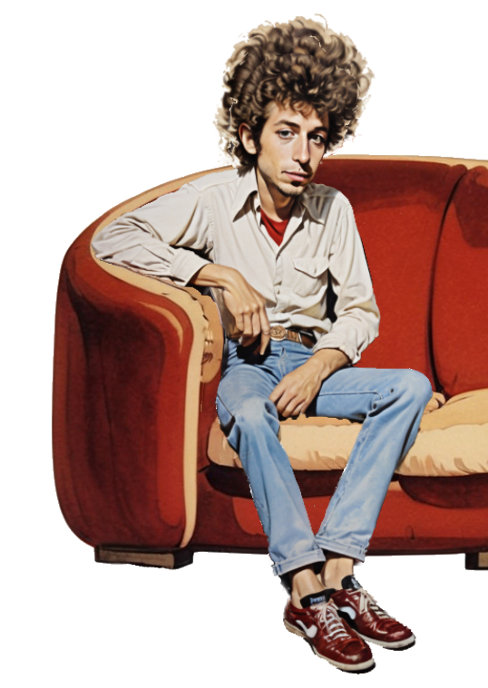
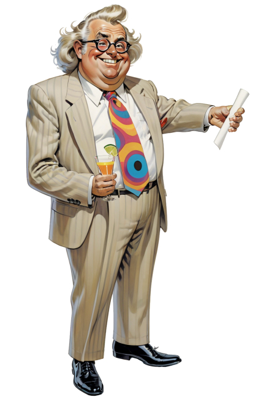
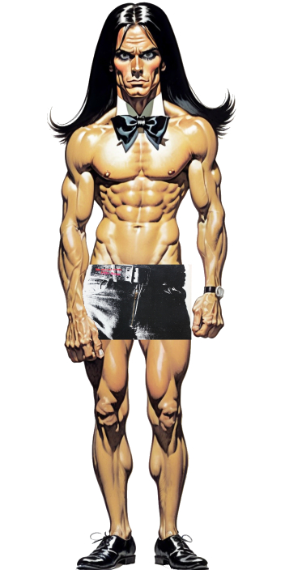
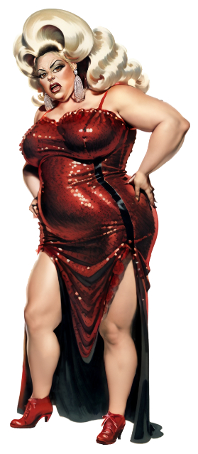
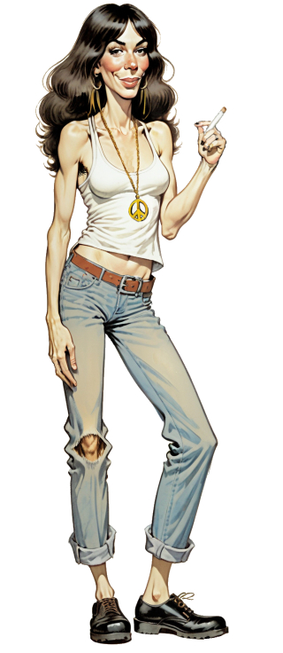
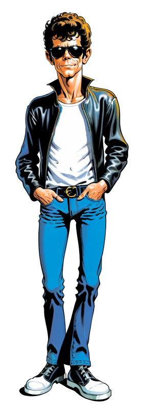
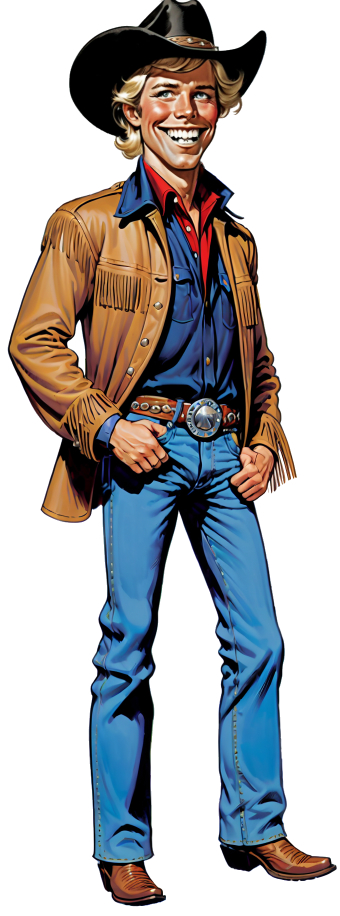
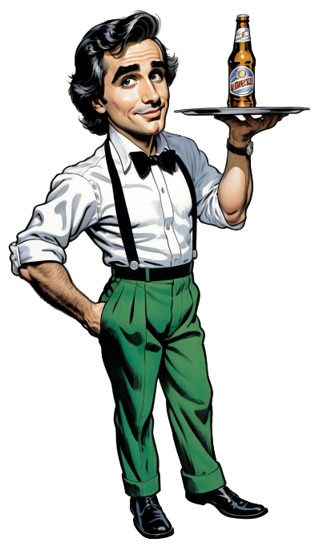

# *Ballad of a Thin Man*: an illustration of the Bob Dylan song
© Paul Pritchard, 2023

This repository concerns my illustration below of Bob Dylan's song *Ballad of a Thin Man* from his great 1965 album
[*Highway 61 Revisited*](https://en.wikipedia.org/wiki/Highway_61_Revisited).
I discuss how the illustration reflects the key components of the song,
discuss each of the various characters individually,
and tell how the project was conceived and carried out.

## The setting

The setting for the illustration is a party at [Andy Warhol's Factory](https://en.wikipedia.org/wiki/The_Factory)
in New York City in the mid-1960s.
The Factory was decorated in meth chic style, with silver paint and tin-foil and mirrors,  Warhol's prints displayed on the walls,
and a distinctive shabby curved red velvet couch.
The Factory's floor was concrete.

## The song

The song concerns a presumably thin man called "Mr Jones" who is "very well-read, it's well-known"
(he's even "been with the professors" and "been through all of F. Scott Fitzgerald's books"),
but who is extremely unsettled and anxious.
So our man is represented by the quintessential anxious intellectual New Yorker, Mr Woody Allen.
He has a pencil in his hand, as specified in the song.

Mr Jones "see[s] somebody naked" in the first verse, and asks "Who is that man?".
The answer is Joe Dallesandro, a typical (if that is possible) member of Warhol's crew,
who was a nude model and gay icon, and featured in several Warhol movies, starting with *Lonesome Cowboys* in 1968.

A "geek" "walks up" to Mr Jones and hands him a bone.
The word "geek" back then meant something like a circus freak. A gross man, one might say.
The geek is represented by Dylan's manager at the time, Albert Grossman, who is shown handing Woody Allen a rolled up sheet of paper,
representing his standard contract.
The paper looks like a bone,
and the idiom "to throw (or hand) someone a bone" means to give them something that is not valuable.
Dylan sacked Grossman soon after when he discovered he was ripping him off on song royalties.

A "sword-swallower" comes up to Mr Jones, "clicks his high heels", kneels, and says
"here is your throat back, thanks for the loan".
He is represented by Leonard Bernstein, who is offering his red handkerchief to the distressed (and sweaty?) Woody Allen.
The sword references the baton that Bernstein famously wielded in his role as conductor,
and "sword-swallower" references his sexual predilections, which fit with his appearance at a Warhol party.
And the red handkerchief looks like a throat.

Mr Jones then notices a "one-eyed midget".
He is represented by Paul Simon, who is what used to be called vertically challenged,
and whom, as a singer-songwriting rival, Dylan would have delighted in disparaging.

Some other people shown in the illustration also fit in with the song, contributing to Mr Jones's disquiet and unease.
They are represented by the very unconventional (one might say "queer") pair of the art photographer Robert Mapplethorpe,
wearing the kinky leather gear he favored, with his hand on Woody Allen's shoulder,
and the drag queen Divine.

Robert Mapplethorpe's (female!) lover is also shown, representing one of the arty types that gravitated to Warhol.
She was a poet. Her name is Patti Smith.

Dylan himself is observing all this from his seat in the corner of the famous Warhol couch, thinking "there's a song in this".
Seated beside him is Rico "Ratso" Rizzo, whose friend (and male prostitute) Joe Buck is standing close behind in his cowboy clothes.
The movie *Midnight Cowboy* (1969) was based on them. It featured a party just like this one.
Rico would have told Dylan some wild stories. Perhaps his song *Desolation Row* was based on them.

Rounding out the partygoers are Andy Warhol himself, with the camera he often carried,
and Lou Reed, who played at Warhol's Factory parties as a member of the band
[The Velvet Underground](https://en.wikipedia.org/wiki/The_Velvet_Underground), which was managed by Warhol.
It went nowhere fast.

Finally, there's the hired help, a young man working as a waiter to help pay his way through film school.
His name is Martin Scorsese.

## Dramatis Personae

### Bob Dylan

[Bob Dylan](https://en.wikipedia.org/wiki/Bob_Dylan) was born in 1941.
He moved to New York City in 1961 to join the burgeoning folk scene.
In his early golden period, in the 1960s, he released 9 groundbreaking albums of original folk and then rock music.
*Highway 61 Revisited*, from which our song is drawn, is a serious contender for his greatest masterpiece.
Dylan was introduced to Andy Warhol in 1965, by Dylan's then lover, the model and socialite [Edie Sedgwick](https://en.wikipedia.org/wiki/Edie_Sedgwick).
Warhol subjected him to one of his so-called "screen tests",
and Dylan took an Elvis painting for his trouble, which he later traded for a couch (not Warhol's one).
In 2016, Dylan was awarded the Nobel Prize in Literature.
 

### Andy Warhol

[Andy Warhol](https://en.wikipedia.org/wiki/Andy_Warhol) was born in 1928.
He moved to New York City in 1949, and transitioned from being a commercial artist to a fine artist concentrating on printmaking,
but also doing painting, photography, movies and short videos.
He is one of the founders of [Pop Art](https://en.wikipedia.org/wiki/Pop_art),
and pioneered the use of assistants and other aspects of a factory system of art production.
The "Double Elvis" print that Dylan took is now in MoMa; $50 million would be as good a guess as any of its current worth.
Warhol died in 1987.
 

### Woody Allen

[Woody Allen](https://en.wikipedia.org/wiki/Woody_Allen) was born in 1935, and is a native New Yorker.
He started work writing comedy for tv and magazines, then did standup comedy,
and then wrote, directed, and starred in movies from the late 1960s, for which he won many prestigious awards.
His comedy persona was that of an anxious, insecure, intellectual nebbish, perfect for Mr Jones.
At the age of 61 he married his daughter. They are still together.
 

### Albert Grossman

[Albert Grossman](https://en.wikipedia.org/wiki/Albert_Grossman) was born in 1926.
Bob Dylan was the most famous of many significant musical artists that he managed.
Dylan sacked Grossman when he discovered that Grossman had given himself 50% of Dylan's publishing rights.
Grossman died in 1986, while flying on a Concorde.
 

### Leonard Bernstein

[Leonard Bernstein](https://en.wikipedia.org/wiki/Leonard_Bernstein) was born in 1918.
He moved to New York City in 1941, and lived there the rest of his life.
He was a famous conductor, composer (notably of *West Side Story*) and popularizer of classical music.
He was married but had affairs with both sexes. He is the subject of the movie *Maestro* (2023).
He died in 1990.
 

### Paul Simon

[Paul Simon](https://en.wikipedia.org/wiki/Paul_Simon) was born in 1941, the same year as Bob Dylan.
He is also considered one of the greatest singer-songwriters of his time, and has received numerous prestigious awards.
He has had a lifelong assocation with New York City.
He claims to be 5 foot 3 inches.
 

### Joe Dallesandro

[Joe Dallesandro](https://en.wikipedia.org/wiki/Joe_Dallesandro) was a nude model and Warhol "superstar" who appeared
in several of Warhol's movies, such as the aptly titled *Flesh* and *Trash*.
His youthful good looks and physique made him a gay icon.
Joe claims to have been the subject of the cover of The Rolling Stones' album [*Sticky Fingers*](https://en.wikipedia.org/wiki/Sticky_Fingers),
which featured a close-up photo taken by Andy Warhol of the crotch area of a visibly well-endowed man wearing jeans.
This is disputed.
 

### Divine

[Divine](https://en.wikipedia.org/wiki/Divine_(performer)) was the stage name of the drag queen alter ego of Harris Glenn Milstead.
He was born in 1945, in Baltimore, where he became closely assocaited with the director John Waters, acting in many of his movies,
and achieving mainstream recognition with *Hairspray* (1988).
He was gay, hung out with Andy Warhol in the 1970s, and was the subject for some of his artworks.
He died in 1988.
Here he stands in for someone who would not be out of place at a Warhol Factory party in the mid-1960s.
 

### Robert Mapplethorpe

[Robert Mapplethorpe](https://en.wikipedia.org/wiki/Robert_Mapplethorpe) was born in New York City in 1946.
He was an art photographer best known for his black and white flower studies and controversial portraits documenting the gay kink scene.
Patti Smith was his lover at the end of the 1960s, after which he had exclusively gay relationships.
He designed jewelry worn by Joe Dallesandro, and was closely associated with Andy Warhol.
He died in 1989.
 

### Patti Smith

[Patti Smith](https://en.wikipedia.org/wiki/Patti_Smith) was also born in 1946.
She moved to New York City in 1967, where she was a poet and performance artist, eventually morphing into a renowned rock singer.
Her lover Robert Mapplethorpe took the cover photos for her early albums.
She accepted the Nobel Prize for Literature on behalf of Bob Dylan.
 

### Lou Reed

[Lou Reed](https://en.wikipedia.org/wiki/Lou_Reed) was born in 1942, and was a native New Yorker.
He founded the famously influential band *The Velvet Underground* in 1965.
After Andy Warhol took over as its manager, it was a fixture at Warhol Factory parties.
Reed left the band in 1970 and embarked on a very successful solo career.
He died in 2013.
 

### Rico "Ratso" Rizzo

Enrico Salvatore Rizzo was a fictional character, a sickly Italian-American low-life New York City hustler,
in the movie *Midnight Cowboy* (1969).
He was played by [Dustin Hoffman](https://en.wikipedia.org/wiki/Dustin_Hoffman).
The movie was based on the 1965 novel by James Leo Herlihy, and won 3 Oscars, including Best Picture.
Rico dies on a Greyhound bus on the way to Florida, in the arms of ...
 

### Joe Buck

Joe Buck was a fictional character, a handsome young Texan self-declared stud, who moved to New York City as a male prostitute,
in the movie *Midnight Cowboy* (1969).
He was played by [Jon Voight](https://en.wikipedia.org/wiki/Jon_Voight).
 

### Martin Scorsese

[Martin Scorsese](https://en.wikipedia.org/wiki/Martin_Scorsese) was born in 1942, and is a native New Yorker.
His entire working life has been devoted to cinema, and he is universally regarded as one of the preeminent directors of his time.
He first filmed Bob Dylan as part of his 1978 documentary *The Last Waltz* on
[The Band](https://en.wikipedia.org/wiki/The_Band)'s farewell concert.
Subsequently, he made *Rolling Thunder Revue: a Bob Dylan Story by Martin Scorsese*.
 

## The making of the artwork

Since I have aphantasia (literally no visual imagination), I have to work hard to get ideas for my paintings.
The advent of text-to-image generative AI therefore appealed to me as a source of visual inspiration,
with the bonus that I could experience firsthand what I consider one of the greatest engineering feats of my former field of work,
Computer Science.

Text-to-image starts with text, and lyrics of favorite songs appealed as a source.
A painting based on Leonard Cohen's *Famous Blue Raincoat* turned out well.
So I thought I'd try a more complex song.
*Ballad of a Thin Man* appealed because of its very inscrutability.
I did not realize how challenging it would prove to be.
I started with the open-source Stable Diffusion on my own modest PC to generate prototype components of the illustration,
but did a lot of subsequent image manipulation and drawing using Affinity Photo and Procreate.
Many thousands of images would have been generated as the artwork evolved.

The original conception was semi-realist; something in a Neo Rauch vein.
But I couldn't generate any starting material with a tone that I was happy with.
Eventually, I decided the tone had to be satirical.
With the cast of characters growing by the day, I settled on something like the Mad Magazine movie parodies of my youth in the 1960s,
which had the virtue of belonging to the same time period as the song.

When Nana Banana Pro was released I could finally achieve the results I imagined (non-visually!).

So this artwork is intended as a tribute to that golden age of illustration,
and in particular [Jack Davis](https://en.wikipedia.org/wiki/Jack_Davis_(cartoonist)),
whose amazing vitality it unfortunately lacks.
Hence the [Alfred E. Neuman](https://en.wikipedia.org/wiki/Alfred_E._Neuman) Warhol-style print on the wall.
The subject of the other Warhol-style print is the sort of thing I imagine Jack Davis might have chosen,
had he lived in our time.

## The movie poster version

Inspired by Jack Davis's great movie poster for "Its a Mad, Mad, Mad, Mad World", I adapted my cartoon in a similar fashion.

